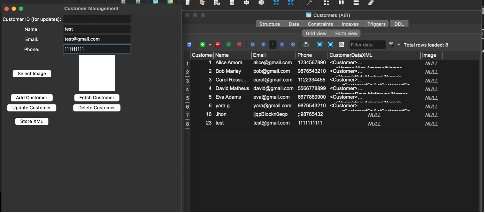
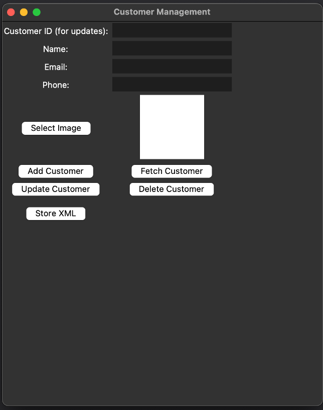
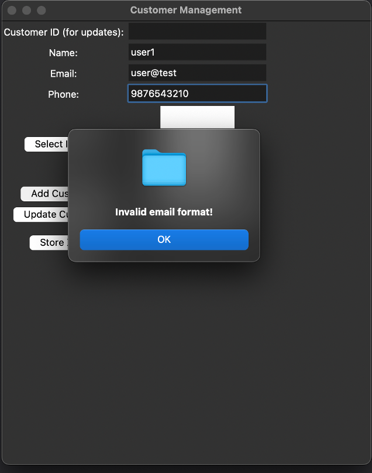
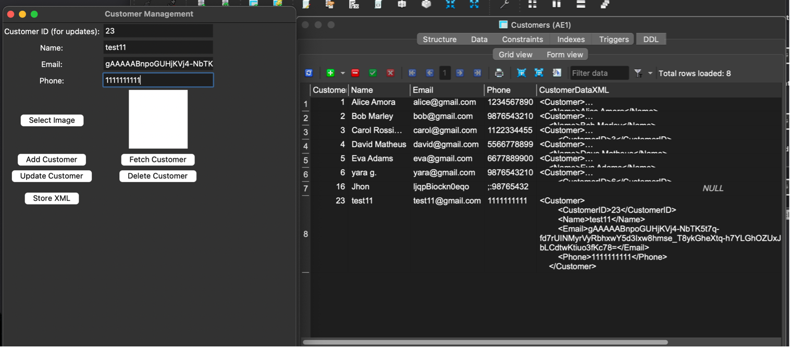
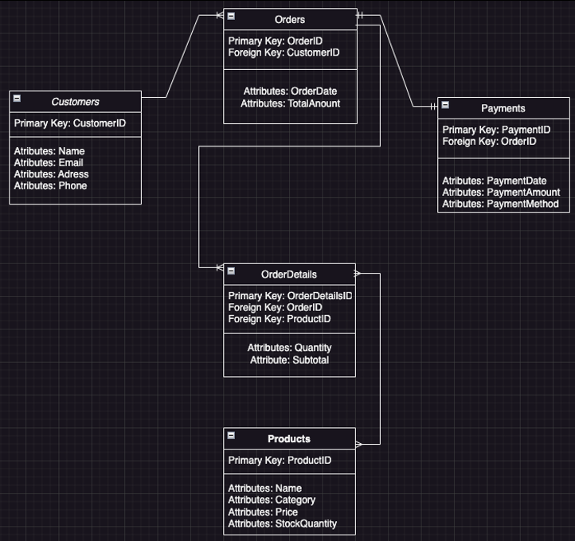

# Secure Data & Identity Manager (Python)

## Project Overview

Secure Data & Identity Manager is a desktop application developed in Python for securely managing customer information. The application demonstrates secure software development principles by encrypting sensitive data before storage, validating user input, handling customer images as binary data (BLOBs), and exporting customer records in XML format.

This project combines desktop application development, database management, encryption, and data serialization into a single secure solution.

---

## My Role

This was an individual university project where I designed and developed the complete application using Python.

---

## My Contributions

- Designed and developed the desktop application using Python and Tkinter.
- Implemented SQLite database storage for customer records.
- Applied Fernet symmetric encryption to protect sensitive customer information.
- Stored customer images as binary data (BLOBs).
- Implemented XML export functionality.
- Added email and phone number validation using regular expressions.
- Implemented Create, Read, Update and Delete (CRUD) operations.
- Solved macOS compatibility issues related to the Tkinter interface.

---

## Technologies & Tools

### Programming Language

- Python

### Database

- SQLite3

### Desktop GUI

- Tkinter

### Security

- Fernet Encryption (Cryptography)

### Libraries

- Pillow
- Cryptography

---

## Key Features

- Secure customer management
- Email encryption
- SQLite database
- Image (BLOB) storage
- XML export
- CRUD operations
- Email and phone validation
- Desktop graphical interface

---

# Project Showcase

## Main Application

The main interface allows users to add, search, update and delete customer information through a simple desktop application.

---

## Customer Management

Customer information is managed through a CRUD interface connected directly to the SQLite database.

---

## Security Features

Sensitive customer information is protected using Fernet symmetric encryption. Email addresses are encrypted before being stored and can only be accessed through the application using the encryption key.

---

## Input Validation

The application validates user input before storing records, preventing invalid email addresses and incorrect phone number formats.

---

## XML Storage

Customer records can be exported as XML, demonstrating data serialization and interoperability between different systems.

---

## Database Design

The database was designed using a relational model, supporting secure customer management and efficient data storage.

---

## What I Learned

This project strengthened my understanding of:

- Secure software development
- Symmetric encryption
- Database design
- Desktop application development
- Data validation
- XML serialization
- CRUD application architecture
- Python application development

---

## Future Improvements

If I continued developing this application, I would:

- Add user authentication and login.
- Implement role-based access control.
- Improve the user interface with a modern design.
- Support encrypted cloud backups.
- Add password hashing for user accounts.
- Implement automatic encryption key management.

---

## Conclusion

This project demonstrates my ability to develop secure desktop applications using Python while integrating encryption, database management, validation techniques, and structured data storage into a practical software solution.
