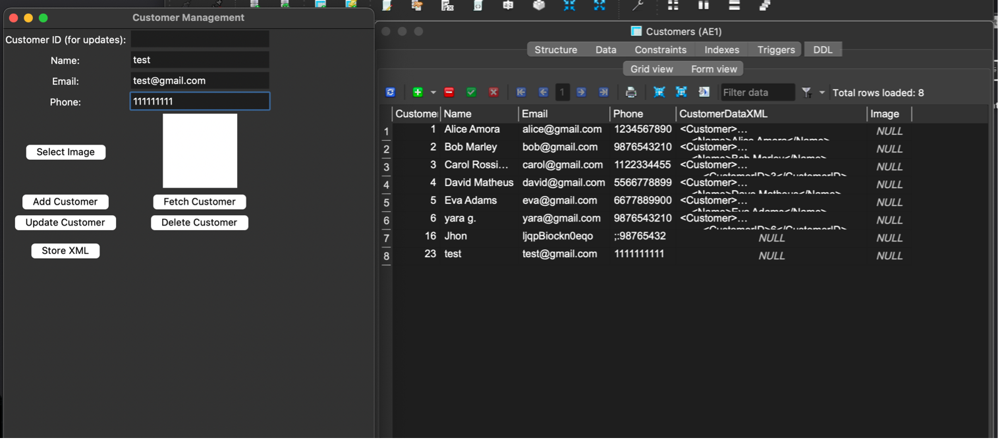
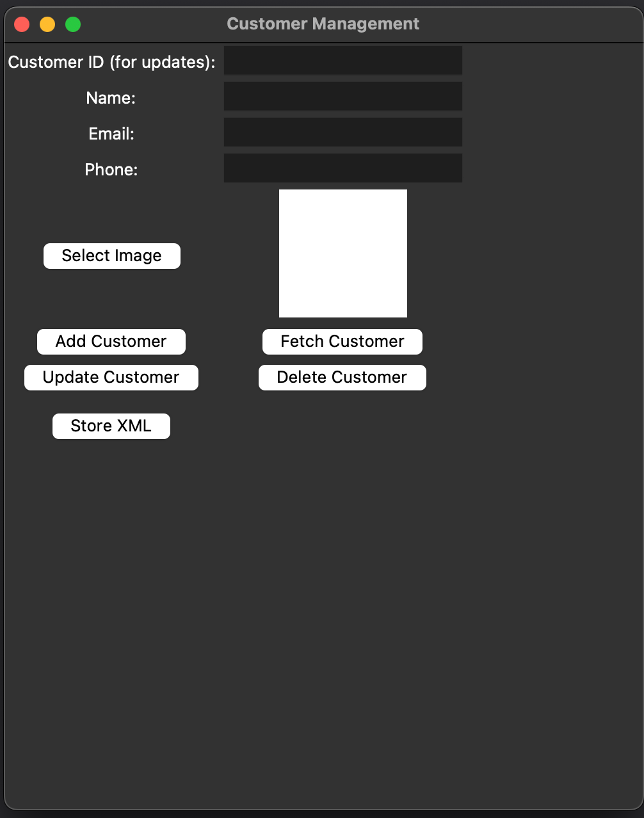
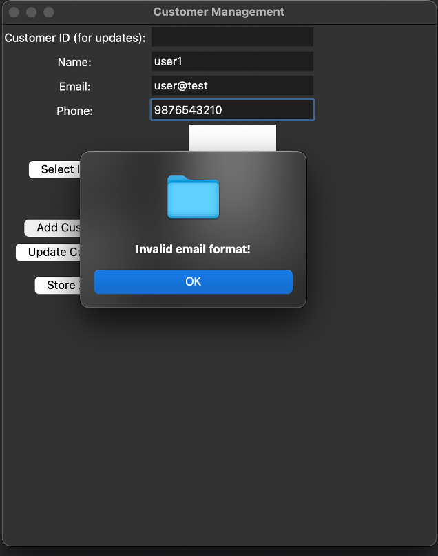
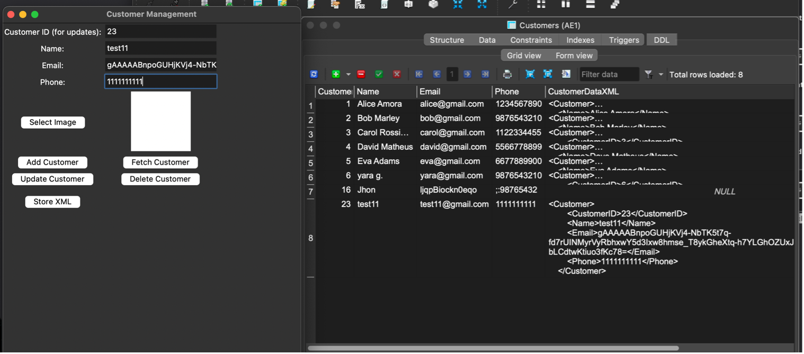
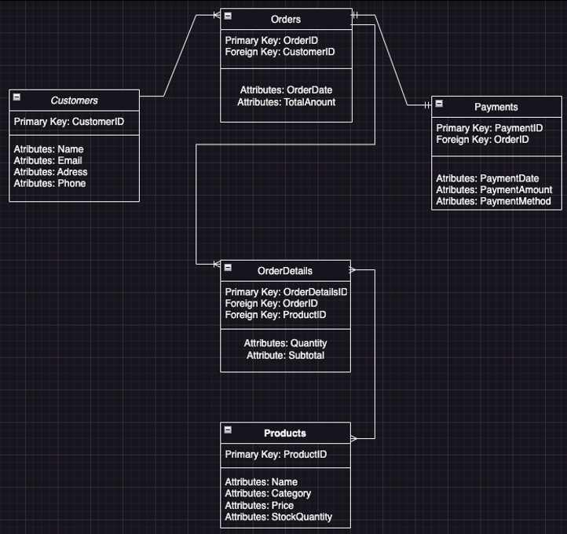

# 🔒 Secure Data & Identity Manager (Python)



A secure desktop application developed in **Python** for managing customer information using encryption, structured database storage, and data validation.

The application demonstrates secure software development principles by combining encryption, SQLite database management, XML data export, and a graphical desktop interface built with Tkinter.

---

# 📖 Project Overview

Secure Data & Identity Manager is a desktop application designed to securely store and manage customer information.

The application encrypts sensitive customer data before storage, validates user input, stores customer images as binary objects (BLOBs), and allows records to be exported in XML format.

The project demonstrates practical experience with desktop application development, secure programming techniques, database management, and structured data handling.

---

# ⭐ Project Highlights

- Individual university project
- Python desktop application
- Secure data storage using Fernet encryption
- SQLite relational database
- Customer image storage (BLOB)
- XML data export
- CRUD functionality
- Input validation using Regular Expressions
- Tkinter graphical user interface

---

# 👨‍💻 My Role

This was an individual university project where I independently designed, developed, tested, and documented the complete application using Python.

---

# ✨ Core Features

- Secure customer management
- Fernet symmetric encryption
- SQLite database integration
- Customer image storage (BLOB)
- XML export functionality
- Complete CRUD operations
- Email validation
- Phone number validation
- Desktop graphical interface

---

# 🛠 Technologies & Tools

| Category | Technologies |
|-----------|--------------|
| Programming Language | Python |
| Desktop GUI | Tkinter |
| Database | SQLite3 |
| Security | Fernet Encryption (Cryptography) |
| Libraries | Pillow, Cryptography |

---

# 📸 Application Showcase

## Main Application


The main interface provides a simple desktop environment for creating, viewing, updating, and deleting customer records.

---

## Customer Management



Customer records are managed through a complete CRUD interface connected directly to the SQLite database.

---

## Security Features


Sensitive customer information is protected using Fernet symmetric encryption. Email addresses are encrypted before being stored and are only decrypted when accessed through the application.

---

## Input Validation



Regular expressions validate email addresses and phone numbers before records are stored, helping maintain data integrity.

---

## XML Export



Customer records can be exported as XML, demonstrating structured data serialisation and interoperability between different systems.

---

## Database Design



The relational database structure was designed to efficiently manage customer information while supporting secure storage and CRUD operations.

---

# 🔄 Application Workflow

```text
User

↓

Tkinter Desktop Interface

↓

Input Validation

↓

Fernet Encryption

↓

SQLite Database

↓

Retrieve / Update / Export XML
```

---

# 🔐 Security Features

The application applies several secure programming practices throughout the customer management process.

These include:

- Fernet symmetric encryption
- Input validation using Regular Expressions
- Secure storage of customer information
- Binary image (BLOB) storage
- Structured XML export
- Separation between application logic and database operations

---

# 🗄 Database Design

SQLite is used to manage customer records efficiently while supporting CRUD operations and encrypted data storage.

The database stores:

- Customer information
- Encrypted email addresses
- Phone numbers
- Customer images (BLOB)
- Unique customer identifiers

---

# 📚 What I Learned

Developing this application strengthened my understanding of secure software development and desktop application design.

Key learning outcomes include:

- Python application development
- Desktop GUI development using Tkinter
- SQLite database design
- Fernet symmetric encryption
- Secure data storage
- CRUD application architecture
- Data validation using Regular Expressions
- XML data serialisation
- Binary data (BLOB) management

---

# 🚀 Future Improvements

If development continued, potential improvements would include:

- User authentication and login
- Role-Based Access Control (RBAC)
- Modernised user interface
- Encrypted cloud backups
- Password hashing
- Automatic encryption key management
- Search and filtering improvements

---

# ⚙ Installation & Setup

## Clone the Repository

```bash
git clone https://github.com/yurihenrique98/Secure-Data-Identity-Manager.git
```

---

## Install Dependencies

```bash
pip install cryptography pillow
```

---

## Run the Application

```bash
python main.py
```

---

# 🎯 Conclusion

Secure Data & Identity Manager demonstrates my ability to develop secure desktop applications using Python while integrating encryption, relational database management, structured validation, and secure data storage into a practical software solution.

The project strengthened my understanding of secure software engineering principles and reinforced the importance of protecting sensitive information through encryption and robust data validation techniques.

---

# 👨‍💻 Author

**Yuri Henrique Gomes de Oliveira**

Graduate Software Developer

- GitHub: https://github.com/yurihenrique98
- LinkedIn: https://www.linkedin.com/in/yuri-henrique-gomes-de-oliveira-07a4bb395

---

## ⭐ If you found this project interesting, feel free to star the repository!
